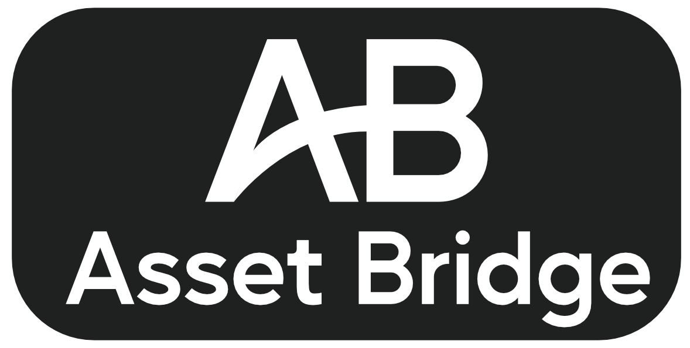
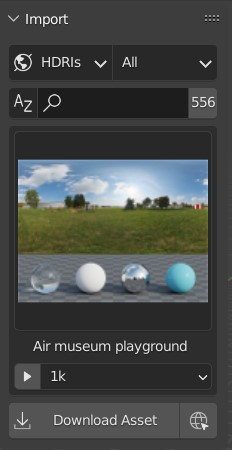

<!--  -->
<!-- width=150 -->

<!--   -->
# Download free assets in a few clicks
Asset bridge is a blender addon to make downloading free assets from online sites easy. With it you can simply select the asset you want to import and click the "Download" button for it to be automatically downloaded and imported into your scene.

Currently the addon works with [PolyHaven](https://polyhaven.com), which gives instant access to almost a thousand free assets from within Blender. If there's enough interest I might also try to add support for other free websites as well, such as [AmbientCG](https://ambientcg.com/) and [CGBookcase](https://www.cgbookcase.com/)

# Installation

1. Download the addon zip from the [releases page](https://)

