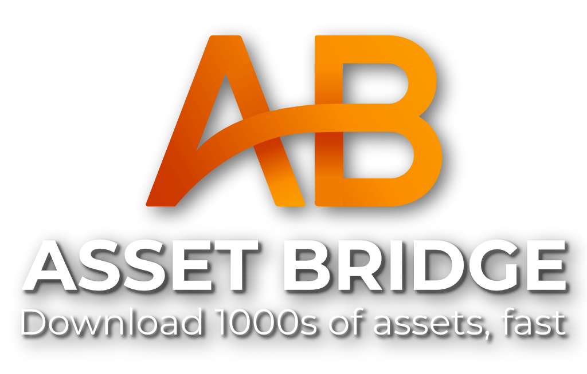
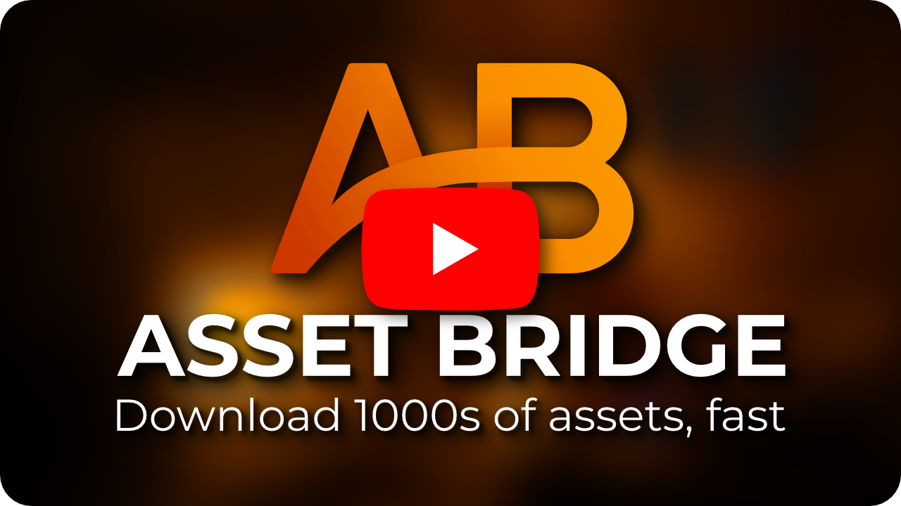

  

Asset Bridge is a Blender addon for automatically downloading free assets from sites like Polyhaven.com and AmbientCG.com, all straight from the asset browser:

<!-- Cabin video: -->
https://user-images.githubusercontent.com/59890307/229322956-ac0e563f-8a0d-4277-86bf-3481e5379730.mp4

# Installation

1. You can download the addon from the [releases page](https://github.com/strike-digital/asset_bridge/releases/latest)
1. In Blender go to Edit > Preferences > Addons > Install and select the zip file you just downloaded
1. Then you'll need to select and set up the asset library folder that the downloaded assets will be stored in in the preferences.
1. You're done!

<!-- Files downloading video: -->
https://user-images.githubusercontent.com/59890307/229310826-35a6f546-0dbb-445e-b2e3-57ebf8b7e9c0.mp4
# Usage

Check out this youtube video for a quick overview of how to use the addon, plus some useful tips and tricks:

# Support the asset creators

If you [buy the addon on the Blender Market](https://blendermarket.com/products/asset-bridge), a portion of the sale (30%) will go straight to the creators, helping them to continue to create the assets that the addon relies on.

And if you want to support them directly, you can donate to each site here:

### [:heart: Polyhaven.com](https://www.patreon.com/polyhaven)

### [:heart: AmbientCG.com](https://www.patreon.com/ambientCG)

This addon wouldn't be possible without the incredible work that the people behind these sites do, so be sure to send them some love