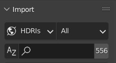
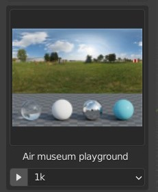
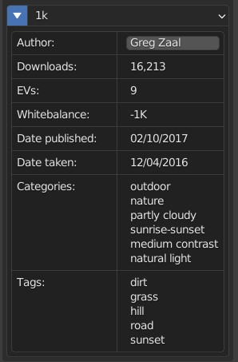
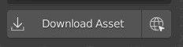

# Try beta 2.0 now
The 2.0 version features a full rewrite of the addon and brings support for the asset browser, UI widgets, and support for assets from [abientcg.com](https://ambientcg.com/), bringing the total number of available assets to >2,700

try it out here: https://github.com/strike-digital/asset_bridge/releases/tag/2.0.0
 

 
<!--  -->
<!-- width=150 -->

<!--   -->

# Download free assets in a few clicks
Asset bridge is a blender addon to make downloading free assets from online sites easy. With it you can simply select the asset you want to import and click the "Download" button for it to be automatically downloaded and imported into your scene.

Currently the addon works with [PolyHaven](https://polyhaven.com), which gives instant access to almost a thousand free assets from within Blender. If there's enough interest I might also try to add support for other free websites as well, such as [AmbientCG](https://ambientcg.com/) and [CGBookcase](https://www.cgbookcase.com/)

# Installation

1. Download the addon zip from the [releases page](https://github.com/strike-digital/asset_bridge/releases/latest)
1. In Blender go to Edit > Preferences > Addons > Install and select the zip file you just downloaded
1. You'll then need to download the preview images of all of the assets. This can be done by clicking the button in the preferences, and then waiting for the progress bar to complete. For me, this takes about 15s, but that will vary from computer to computer.
1. You're done!

# How to use

1. You can find the addon panel in the N-sidebar in the 3D viewport.
From there, you can use the interface to select the type and category of asset you want to find, search for a specific name or tag, and sort the results according to various attributes such as downloads, publishing date etc.

    

2. You can then view the results by clicking on the large thumbnail preview.

    
3. Then, below that, you can select the quality of the asset you want to download, and if you click the arrow, you can view more info about it, such as the author, number of downloads, real world scale, etc.

    

4. If you want to view the asset online, you can then click the website button to the right of the download button.

    

5. Finally, simply click the "Download asset" button, and it will be automatically downloaded and imported into your scene!

# Support Polyhaven ♥
I'm not affiliated with them, but without the amazing work of the Polyhaven devs and contributers, this addon wouldn't be possible, so be sure to send them some love :)

## [Join the Patreon here](https://www.patreon.com/polyhaven/overview)

## [And visit the site here](https://polyhaven.com)